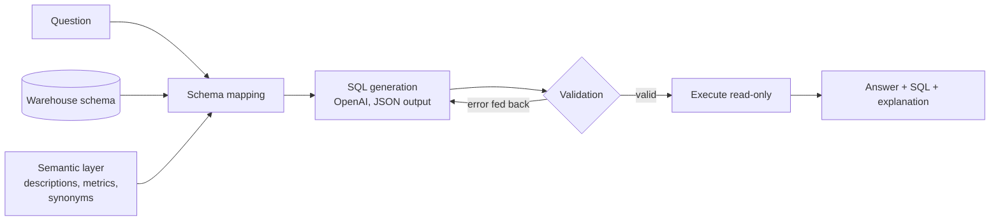

# NL2SQL Assistant

Ask questions about a data warehouse in plain English and get back a validated SQL query, the results, and an explanation. Or go the other way: paste any SQL query and get a plain-English explanation of what it does, with common mistakes flagged.

> "Which 3 countries had the highest revenue in 2024?"
> → generates SQL, checks it is safe and correct against the schema, runs it, and shows the answer with the query behind it.

Built to let non-technical users self-serve answers from enterprise data, without handing an LLM unchecked access to the database. The three core pieces are **schema mapping**, **SQL generation** and **query validation**, plus an **evaluation harness** that measures accuracy.

## How it works



**1. Schema mapping** ([`schema_context.py`](src/nl2sql/schema_context.py), [`semantic_layer.yaml`](semantic_layer.yaml))
A raw schema says *what columns exist*; it doesn't say what "revenue" or an "active customer" means. The semantic layer adds table and column descriptions, synonyms ("clients" → `customers`, "turnover" → revenue) and business metric definitions. For each question the assistant:
- scores tables for relevance and keeps the useful ones, plus any tables needed to join them,
- always includes the tables a matched business definition depends on,
- shows the model the real values of low-cardinality columns, so it filters on `'completed'` rather than guessing `'Completed'`,
- injects only the business definitions the question mentions.

Run `nl2sql context "your question"` to see exactly what the model receives.

**2. SQL generation** ([`prompts.py`](src/nl2sql/prompts.py), [`llm.py`](src/nl2sql/llm.py))
OpenAI with structured (JSON-schema) output returns `sql`, `explanation` and `assumptions`. The prompt is dialect-aware (DuckDB or SQLite date functions differ), and the model may decline questions the data can't answer instead of inventing a query. The pipeline depends on a two-method interface, so the LLM is swappable and fully fakeable in tests.

**3. Query validation** ([`validator.py`](src/nl2sql/validator.py))
Every query passes six checks before it runs:

| Check | Catches |
|---|---|
| Parse (sqlglot) | Syntax errors, multiple statements (`SELECT 1; DROP TABLE ...`) |
| Read-only | `INSERT`, `UPDATE`, `DELETE`, `DROP`, `ATTACH`, `COPY`, `PRAGMA`... |
| Safe functions | File and network access: `read_csv('/etc/passwd')`, `load_extension`, `getenv` |
| Schema check | Hallucinated tables and columns, resolved through joins, aliases and CTEs |
| Row limit | Adds `LIMIT` when missing, caps oversized ones |
| Dry run | Anything else the engine rejects, via `EXPLAIN`, without executing |

A failed check produces an error message written for the model, which is fed back for a corrected attempt (up to 3 by default). On top of that, the database connection is opened **read-only**, with DuckDB's external file access disabled. Validation is the first line of defence, not the only one.

**4. Evaluation** ([`evaluation.py`](src/nl2sql/evaluation.py), [`evals/questions.yaml`](evals/questions.yaml))
22 questions (easy / medium / hard, including two the data *cannot* answer) with hand-written gold SQL. Scoring is by **execution accuracy**: the predicted result must contain the same data as the gold result, ignoring column names, column order and harmless formatting differences (`2024` vs `'2024'`, `2025-01` vs `2025-01-01`). Each run reports accuracy by difficulty, first-try validity rate, average attempts, latency and token usage, and saves a JSON report.

## Quick start

Requires Python 3.10+ and an OpenAI API key.

```bash
cd nl2sql-assistant
python -m venv .venv && source .venv/bin/activate      # Windows: .venv\Scripts\activate
pip install -e ".[app,dev]"

cp .env.example .env            # then put your OPENAI_API_KEY in .env

nl2sql seed                     # builds data/warehouse.duckdb (sample e-commerce data)
nl2sql ask "What was our total revenue in 2025?"
streamlit run app.py            # web UI
nl2sql eval                     # accuracy on the evaluation set
pytest                          # 130+ tests, no API key needed
```

Settings (in `.env`): `OPENAI_MODEL` (default `gpt-4.1-mini`), `NL2SQL_DB` (a `.duckdb` or `.sqlite` file), `NL2SQL_MAX_ROWS`, `NL2SQL_MAX_ATTEMPTS`.

## Explain a query (SQL → English)

The reverse direction: give it any SQL query and it explains what the query does in plain English, without running it. Useful for reviewing a colleague's query, understanding a legacy report, or checking a generated query before trusting it.

```bash
nl2sql explain "SELECT c.country, SUM(oi.quantity * oi.unit_price) AS revenue
                FROM orders o JOIN customers c ON c.customer_id = o.customer_id
                LEFT JOIN order_items oi ON oi.order_id = o.order_id
                WHERE o.status = 'completed' AND oi.discount > 0
                GROUP BY 1 ORDER BY 2 DESC LIMIT 3"
```

Example output (the warnings come from the parser; the prose wording comes from the model and varies):

```
Finds the 3 countries whose customers spent the most on completed, discounted
orders, with the total amount spent per country.

Step by step
  1. Takes only completed orders.
  2. Looks up the customer behind each order to get their country.
  ...

Columns returned
  country    The customer's country.
  revenue    Total spent in EUR, before discounts are subtracted.

Watch out
  ! The filter `oi.discount > 0` is on the LEFT JOINed table oi, which drops the
    unmatched rows the LEFT JOIN was meant to keep, so it behaves like an INNER JOIN.
  ! Revenue here ignores discounts, unlike the official revenue definition.

SELECT · read-only · tables: orders, customers, order_items · 1020 tokens
```

How it works:
1. **Parse first** ([`analyzer.py`](src/nl2sql/analyzer.py)). sqlglot extracts the facts: tables, join types and conditions, filters, grouping, aggregations, sort, limit and output columns. A parser can't be wrong about these, so the LLM doesn't have to guess them.
2. **Check for classic mistakes** deterministically: `x = NULL` (never true), a `LEFT JOIN` silently turned into an inner join by a `WHERE` filter, `NOT IN` with a subquery (breaks on NULLs), joins without a condition, `UPDATE`/`DELETE` without `WHERE`, `SELECT *`, missing `LIMIT`.
3. **Explain** ([`explainer.py`](src/nl2sql/explainer.py)). The LLM writes the prose from the SQL, the parser facts and the semantic layer, so `status = 'completed'` becomes "only completed orders". It also notices when a query deviates from a business definition.
4. **Ground the output.** The returned column list always comes from the parser; the model only supplies meanings, so it can't invent or drop columns.

Options:

| Option | What it does |
|---|---|
| `--file query.sql` or `-` | Read SQL from a file or stdin (several statements are explained one by one) |
| `--dialect postgres` | Parse any sqlglot dialect: `snowflake`, `bigquery`, `tsql`, `postgres`, ... |
| `--audience technical` | Use SQL terms and mention grain and performance (default: `business`) |
| `--offline` | No LLM call or API key: structural walk-through plus checks only |
| `--json` | Machine-readable output |

dbt models work too: `{{ ref('stg_orders') }}` and `{{ source('shop', 'customers') }}` are turned into table names before parsing.

## Sample data

`nl2sql seed` generates a deterministic e-commerce warehouse (the same seed always gives the same data, so the eval answers never drift):

| Table | Rows | Notes |
|---|---|---|
| `customers` | 600 | 7 countries, consumer/business segments, ~7% never ordered |
| `products` | 40 | 5 categories |
| `orders` | 6,000 | 2024–2025, growth trend, Q4 seasonality, completed/cancelled/returned |
| `order_items` | ~9,600 | quantities, prices at time of order, discounts |

## Evaluation results

Run `nl2sql eval` and record results here, so each change to the prompt, semantic layer or model is measured rather than guessed.

| Date | Model | Accuracy | Easy | Medium | Hard | First-try valid |
|---|---|---|---|---|---|---|
| _your first run_ | | | | | | |

## Project structure

```
nl2sql-assistant/
├── app.py                  # Streamlit UI
├── semantic_layer.yaml     # business meaning of the schema
├── evals/questions.yaml    # evaluation set with gold SQL
├── src/nl2sql/
│   ├── cli.py              # nl2sql seed | ask | explain | context | eval
│   ├── analyzer.py         # SQL structure + mistake checks (for explain)
│   ├── explainer.py        # SQL -> plain-English explanation
│   ├── config.py           # settings from env / .env
│   ├── database.py         # DuckDB / SQLite, read-only connections
│   ├── seed.py             # sample warehouse generator
│   ├── semantic.py         # semantic layer loading and term matching
│   ├── schema_context.py   # schema mapping
│   ├── prompts.py          # prompt templates and output schema
│   ├── llm.py              # OpenAI client and test double
│   ├── validator.py        # query validation
│   ├── pipeline.py         # end-to-end flow with self-correction
│   └── evaluation.py       # execution-accuracy evaluation
└── tests/                  # run on SQLite and DuckDB
```

## Design decisions

- **Semantic layer over prompt tweaks.** Most wrong answers come from ambiguous business terms, not SQL syntax. Definitions live in version-controlled YAML that a data team can review, not buried in a prompt.
- **Defence in depth.** The validator blocks unsafe SQL, and the read-only connection makes sure anything that slips through still can't change or read outside the warehouse.
- **Errors as feedback.** Validation errors are phrased for the model, turning a failure into a self-correction step.
- **Measure, don't guess.** Execution-accuracy evals make prompt and model changes comparable.
- **Two backends.** DuckDB for analytics speed; SQLite (built into Python) so tests run anywhere with zero setup.

## Ideas for next steps

- Few-shot examples retrieved by similarity to the question
- Conversation memory for follow-ups ("and for 2024?")
- Charts chosen from the result shape
- Connect to Postgres / BigQuery / Snowflake through sqlglot dialects
- Track eval results over time in CI
